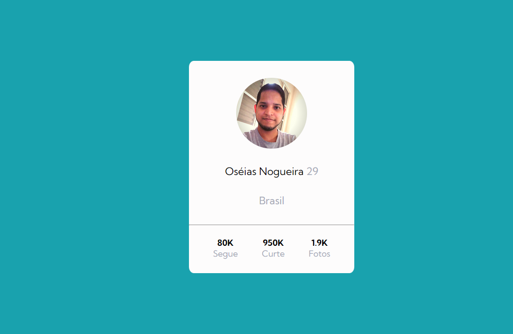
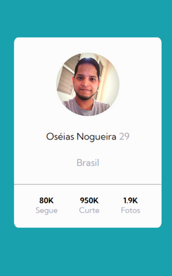

<h1 align="center">Cartão de Perfil 😎</h1>

Abaixo temos o exercício do curso DevQuest de HTML e CSS avançado. A ideia é praticar as habilidades aprendidas dos módulos.

 
 <h2>🕹️ Tecnologias Utilizadas</h2>
    <ul align="center">
        
        
    </ul> 

<h2 align="center">💻 Apresentação Página</h2>

Abaixo temos a representação da página em desktop e smartphones: 

<i>Página em Desktop.</i>

<i>Página em Desktop.</i>

<h2 align="center">🔗 Link da página</h2>

Logo abaixo temos o link da página para visualização e testes:

👉 <a href="https://oseiasweb.github.io/cartao-perfil/" target="_blank">Cartão de Perfil</a>  